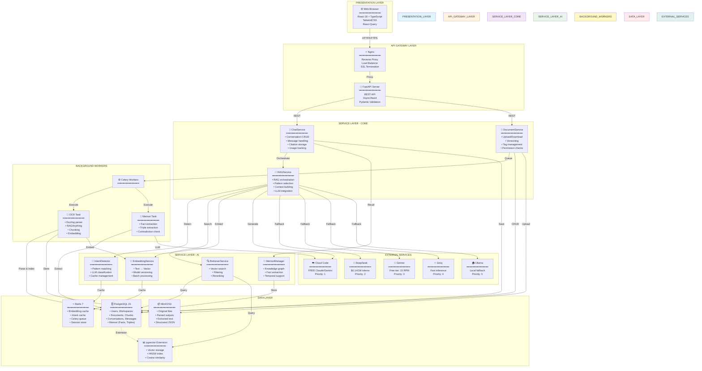
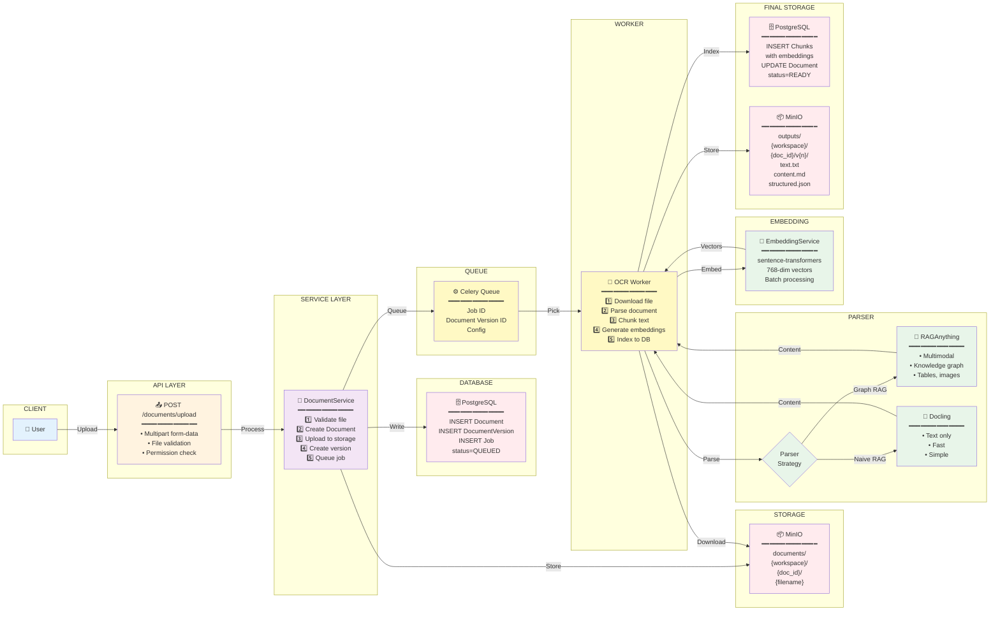
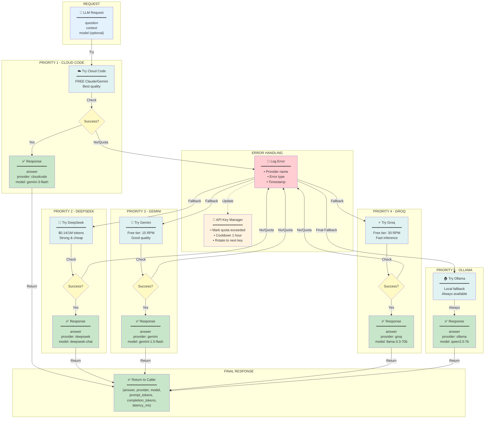

# Sơ Đồ Thiết Kế Kiến Trúc Hệ Thống RAG

> **Tài liệu này**: Các sơ đồ thiết kế kiến trúc dạng layered với ô và đường kết nối
> 
> **Mục đích**: Dễ hình dung và hiểu rõ luồng dữ liệu trong hệ thống

---

## 1. Kiến Trúc Tổng Thể - Layered Architecture



---

## 2. Flow Upload & OCR Processing - Detailed Design



---

## 3. Flow RAG Chat Query - Detailed Design

```mermaid
graph TB
    subgraph "CLIENT"
        USER_QUERY["👤 User Query<br/>━━━━━━━━━━━━━━<br/>'Python là gì?'"]
    end
    
    subgraph "API LAYER"
        CHAT_API["💬 POST /chat/messages<br/>━━━━━━━━━━━━━━<br/>conversation_id<br/>content<br/>tags (optional)"]
    end
    
    subgraph "CHAT SERVICE"
        CHAT_SVC["💬 ChatService<br/>━━━━━━━━━━━━━━<br/>1️⃣ Save user message<br/>2️⃣ Recall memory<br/>3️⃣ Call RAG service<br/>4️⃣ Save assistant message"]
    end
    
    subgraph "MEMORY RECALL"
        MEMORI_RECALL["🧩 MemoriManager<br/>━━━━━━━━━━━━━━<br/>• Get last 10 messages<br/>• Search facts by embedding<br/>• Get knowledge graph<br/>• Build context"]
        DB_MEMORY["🗄️ PostgreSQL<br/>━━━━━━━━━━━━━━<br/>memori_entity_facts<br/>memori_knowledge_graph<br/>messages"]
    end
    
    subgraph "RAG SERVICE"
        RAG_SVC["🧠 RAGService<br/>━━━━━━━━━━━━━━<br/>Orchestrate RAG pipeline"]
    end
    
    subgraph "INTENT DETECTION"
        INTENT_DET["🎯 IntentDetector<br/>━━━━━━━━━━━━━━"]
        PATTERN_MATCH{"Pattern<br/>Match?"}
        LLM_CLASSIFY["🤖 LLM Classify<br/>━━━━━━━━━━━━━━<br/>Cloud Code<br/>DeepSeek<br/>Gemini"]
        INTENT_RESULT["Intent Result<br/>━━━━━━━━━━━━━━<br/>• GREETING<br/>• CHITCHAT<br/>• DOCUMENT_QUERY<br/>• IMAGE_GEN<br/>• CODE_GEN"]
    end
    
    subgraph "VECTOR SEARCH"
        EMB_QUERY["🔢 Embed Query<br/>━━━━━━━━━━━━━━<br/>sentence-transformers<br/>768-dim vector"]
        RETRIEVER["🔍 RetrieverService<br/>━━━━━━━━━━━━━━<br/>• Vector search<br/>• Tag filtering<br/>• Top-k selection"]
        PGVECTOR_SEARCH["📊 pgvector<br/>━━━━━━━━━━━━━━<br/>SELECT chunks<br/>ORDER BY<br/>embedding <=> query<br/>LIMIT 5"]
        RERANK["🎯 Reranking<br/>━━━━━━━━━━━━━━<br/>Cross-encoder<br/>+15-20% precision"]
    end

    
    subgraph "LLM GENERATION"
        CONTEXT_BUILD["📝 Build Context<br/>━━━━━━━━━━━━━━<br/>• Retrieved chunks<br/>• Memory context<br/>• Conversation history"]
        LLM_CHAIN["🤖 LLM Fallback Chain<br/>━━━━━━━━━━━━━━"]
        PROVIDER_1["☁️ Cloud Code<br/>Priority 1"]
        PROVIDER_2["🤖 DeepSeek<br/>Priority 2"]
        PROVIDER_3["🔮 Gemini<br/>Priority 3"]
        PROVIDER_4["⚡ Groq<br/>Priority 4"]
        PROVIDER_5["🏠 Ollama<br/>Priority 5"]
        LLM_RESPONSE["✅ Answer<br/>━━━━━━━━━━━━━━<br/>+ Citations<br/>+ Metadata<br/>+ Tokens"]
    end
    
    subgraph "RESPONSE STORAGE"
        SAVE_MSG["💾 Save Response<br/>━━━━━━━━━━━━━━<br/>• Assistant message<br/>• Citations<br/>• AI usage<br/>• Tokens & cost"]
        DB_SAVE["🗄️ PostgreSQL<br/>━━━━━━━━━━━━━━<br/>messages<br/>citations<br/>ai_usage"]
    end
    
    subgraph "BACKGROUND TASK"
        QUEUE_MEMORI["⚙️ Queue Memori Task<br/>━━━━━━━━━━━━━━<br/>Extract facts<br/>Extract triples<br/>Update knowledge graph"]
    end
    
    USER_QUERY -->|Send| CHAT_API
    CHAT_API -->|Process| CHAT_SVC
    
    CHAT_SVC -->|Recall| MEMORI_RECALL
    MEMORI_RECALL -->|Query| DB_MEMORY
    DB_MEMORY -->|Facts & Triples| MEMORI_RECALL
    MEMORI_RECALL -->|Context| CHAT_SVC
    
    CHAT_SVC -->|Query| RAG_SVC
    
    RAG_SVC -->|Detect| INTENT_DET
    INTENT_DET -->|Check| PATTERN_MATCH
    PATTERN_MATCH -->|Yes| INTENT_RESULT
    PATTERN_MATCH -->|No| LLM_CLASSIFY
    LLM_CLASSIFY -->|Classify| INTENT_RESULT
    
    INTENT_RESULT -->|DOCUMENT_QUERY| EMB_QUERY
    INTENT_RESULT -->|GREETING/CHITCHAT| LLM_CHAIN
    
    EMB_QUERY -->|Vector| RETRIEVER
    RETRIEVER -->|Search| PGVECTOR_SEARCH
    PGVECTOR_SEARCH -->|Top-k chunks| RERANK
    RERANK -->|Ranked chunks| CONTEXT_BUILD
    
    CONTEXT_BUILD -->|Prompt| LLM_CHAIN
    
    LLM_CHAIN -->|Try| PROVIDER_1
    PROVIDER_1 -->|Success| LLM_RESPONSE
    PROVIDER_1 -->|Fail| PROVIDER_2
    PROVIDER_2 -->|Success| LLM_RESPONSE
    PROVIDER_2 -->|Fail| PROVIDER_3
    PROVIDER_3 -->|Success| LLM_RESPONSE
    PROVIDER_3 -->|Fail| PROVIDER_4
    PROVIDER_4 -->|Success| LLM_RESPONSE
    PROVIDER_4 -->|Fail| PROVIDER_5
    PROVIDER_5 -->|Always Success| LLM_RESPONSE
    
    LLM_RESPONSE -->|Return| RAG_SVC
    RAG_SVC -->|Return| CHAT_SVC
    
    CHAT_SVC -->|Save| SAVE_MSG
    SAVE_MSG -->|Write| DB_SAVE
    
    CHAT_SVC -->|Queue| QUEUE_MEMORI
    
    CHAT_SVC -->|Response| CHAT_API
    CHAT_API -->|Return| USER_QUERY
    
    style USER_QUERY fill:#e3f2fd
    style CHAT_API fill:#fff3e0
    style CHAT_SVC fill:#f3e5f5
    style MEMORI_RECALL fill:#e8f5e9
    style DB_MEMORY fill:#ffebee
    style RAG_SVC fill:#f3e5f5
    style INTENT_DET fill:#e8f5e9
    style PATTERN_MATCH fill:#fff9c4
    style LLM_CLASSIFY fill:#e8f5e9
    style INTENT_RESULT fill:#c8e6c9
    style EMB_QUERY fill:#e8f5e9
    style RETRIEVER fill:#e8f5e9
    style PGVECTOR_SEARCH fill:#ffebee
    style RERANK fill:#e8f5e9
    style CONTEXT_BUILD fill:#f3e5f5
    style LLM_CHAIN fill:#e0f2f1
    style PROVIDER_1 fill:#e0f2f1
    style PROVIDER_2 fill:#e0f2f1
    style PROVIDER_3 fill:#e0f2f1
    style PROVIDER_4 fill:#e0f2f1
    style PROVIDER_5 fill:#e0f2f1
    style LLM_RESPONSE fill:#c8e6c9
    style SAVE_MSG fill:#f3e5f5
    style DB_SAVE fill:#ffebee
    style QUEUE_MEMORI fill:#fff9c4
```



---

## 4. Flow Memori Knowledge Graph - Detailed Design

```mermaid
graph TB
    subgraph "TRIGGER"
        CHAT_COMPLETE["✅ Chat Response Sent<br/>━━━━━━━━━━━━━━<br/>Message count % 2 == 0"]
    end
    
    subgraph "QUEUE"
        CELERY_QUEUE_M["⚙️ Celery Queue<br/>━━━━━━━━━━━━━━<br/>memori_extraction_task<br/>conversation_id<br/>workspace_id<br/>user_id"]
    end
    
    subgraph "WORKER"
        MEMORI_WORKER["🧠 Memori Worker<br/>━━━━━━━━━━━━━━<br/>Background processing<br/>Non-blocking"]
    end
    
    subgraph "DATA FETCH"
        GET_MESSAGES["📨 Get Messages<br/>━━━━━━━━━━━━━━<br/>Last 6 messages<br/>(3 exchanges)"]
        DB_MESSAGES["🗄️ PostgreSQL<br/>━━━━━━━━━━━━━━<br/>SELECT messages<br/>ORDER BY created_at<br/>LIMIT 6"]
    end
    
    subgraph "FACT EXTRACTION"
        BUILD_PROMPT_F["📝 Build Prompt<br/>━━━━━━━━━━━━━━<br/>Extract:<br/>• Facts<br/>• Preferences<br/>• Attributes"]
        LLM_EXTRACT_F["🤖 LLM Extract<br/>━━━━━━━━━━━━━━<br/>Cloud Code<br/>DeepSeek<br/>Gemini"]
        PARSE_FACTS["📊 Parse Results<br/>━━━━━━━━━━━━━━<br/>JSON format<br/>facts: []<br/>preferences: {}<br/>attributes: {}"]
    end
    
    subgraph "TRIPLE EXTRACTION"
        BUILD_PROMPT_T["📝 Build Prompt<br/>━━━━━━━━━━━━━━<br/>Extract triples:<br/>• Subject-Predicate-Object<br/>• Temporal (valid_at, invalid_at)<br/>• Pronoun resolution"]
        LLM_EXTRACT_T["🤖 LLM Extract<br/>━━━━━━━━━━━━━━<br/>Cloud Code<br/>DeepSeek<br/>Gemini"]
        PARSE_TRIPLES["📊 Parse Triples<br/>━━━━━━━━━━━━━━<br/>JSON array<br/>[{s, p, o, valid_at, invalid_at}]"]
    end
    
    subgraph "VALIDATION"
        VALIDATE_TRIPLES["✅ Validate Triples<br/>━━━━━━━━━━━━━━<br/>• Filter invalid<br/>• Deduplicate<br/>• Check quality"]
    end
    
    subgraph "CONTRADICTION CHECK"
        GET_EXISTING["📚 Get Existing Triples<br/>━━━━━━━━━━━━━━<br/>WHERE entity_id<br/>AND expired_at IS NULL"]
        DB_EXISTING["🗄️ PostgreSQL<br/>━━━━━━━━━━━━━━<br/>memori_knowledge_graph"]
        CHECK_CONFLICT{"Contradiction<br/>Detected?"}
        INVALIDATE["❌ Invalidate Old<br/>━━━━━━━━━━━━━━<br/>UPDATE<br/>expired_at = NOW()"]
    end
    
    subgraph "STORAGE"
        STORE_FACTS["💾 Store Facts<br/>━━━━━━━━━━━━━━<br/>• Generate embeddings<br/>• Calculate importance<br/>• INSERT facts"]
        STORE_TRIPLES["💾 Store Triples<br/>━━━━━━━━━━━━━━<br/>• INSERT triples<br/>• Set temporal fields<br/>• Link to conversation"]
        STORE_PREFS["💾 Store Preferences<br/>━━━━━━━━━━━━━━<br/>• Category mapping<br/>• Importance scoring<br/>• INSERT preferences"]
        STORE_ATTRS["💾 Store Attributes<br/>━━━━━━━━━━━━━━<br/>• Category mapping<br/>• Importance scoring<br/>• INSERT attributes"]
        DB_STORE["🗄️ PostgreSQL<br/>━━━━━━━━━━━━━━<br/>memori_entity_facts<br/>memori_knowledge_graph<br/>memori_preferences<br/>memori_attributes"]
    end
    
    CHAT_COMPLETE -->|Queue| CELERY_QUEUE_M
    CELERY_QUEUE_M -->|Pick| MEMORI_WORKER
    
    MEMORI_WORKER -->|Fetch| GET_MESSAGES
    GET_MESSAGES -->|Query| DB_MESSAGES
    DB_MESSAGES -->|Messages| GET_MESSAGES
    GET_MESSAGES -->|Messages| MEMORI_WORKER
    
    MEMORI_WORKER -->|Extract Facts| BUILD_PROMPT_F
    BUILD_PROMPT_F -->|Prompt| LLM_EXTRACT_F
    LLM_EXTRACT_F -->|Response| PARSE_FACTS
    
    MEMORI_WORKER -->|Extract Triples| BUILD_PROMPT_T
    BUILD_PROMPT_T -->|Prompt| LLM_EXTRACT_T
    LLM_EXTRACT_T -->|Response| PARSE_TRIPLES
    
    PARSE_TRIPLES -->|Validate| VALIDATE_TRIPLES
    
    VALIDATE_TRIPLES -->|Check| GET_EXISTING
    GET_EXISTING -->|Query| DB_EXISTING
    DB_EXISTING -->|Existing triples| CHECK_CONFLICT
    
    CHECK_CONFLICT -->|Yes| INVALIDATE
    CHECK_CONFLICT -->|No| STORE_TRIPLES
    INVALIDATE -->|Update| DB_STORE
    INVALIDATE -->|Then| STORE_TRIPLES
    
    PARSE_FACTS -->|Facts| STORE_FACTS
    PARSE_FACTS -->|Preferences| STORE_PREFS
    PARSE_FACTS -->|Attributes| STORE_ATTRS
    
    STORE_FACTS -->|Write| DB_STORE
    STORE_TRIPLES -->|Write| DB_STORE
    STORE_PREFS -->|Write| DB_STORE
    STORE_ATTRS -->|Write| DB_STORE
    
    style CHAT_COMPLETE fill:#c8e6c9
    style CELERY_QUEUE_M fill:#fff9c4
    style MEMORI_WORKER fill:#fff9c4
    style GET_MESSAGES fill:#e8f5e9
    style DB_MESSAGES fill:#ffebee
    style BUILD_PROMPT_F fill:#e8f5e9
    style LLM_EXTRACT_F fill:#e0f2f1
    style PARSE_FACTS fill:#e8f5e9
    style BUILD_PROMPT_T fill:#e8f5e9
    style LLM_EXTRACT_T fill:#e0f2f1
    style PARSE_TRIPLES fill:#e8f5e9
    style VALIDATE_TRIPLES fill:#c8e6c9
    style GET_EXISTING fill:#e8f5e9
    style DB_EXISTING fill:#ffebee
    style CHECK_CONFLICT fill:#fff9c4
    style INVALIDATE fill:#ffcdd2
    style STORE_FACTS fill:#e8f5e9
    style STORE_TRIPLES fill:#e8f5e9
    style STORE_PREFS fill:#e8f5e9
    style STORE_ATTRS fill:#e8f5e9
    style DB_STORE fill:#ffebee
```



---

## 5. LLM Provider Fallback Chain - Detailed Design



---

## 6. RAG Patterns Comparison - Design Overview

```mermaid
graph TB
    subgraph "PATTERN SELECTOR"
        QUERY["📝 User Query"]
        SELECTOR{"Select<br/>Pattern"}
    end
    
    subgraph "NAIVE RAG"
        NAIVE["📚 Naive RAG<br/>━━━━━━━━━━━━━━<br/>✅ Simple<br/>✅ Fast<br/>❌ No validation<br/>━━━━━━━━━━━━━━<br/>Retrieve → Generate"]
    end
    
    subgraph "CORRECTIVE RAG"
        CORRECTIVE["🔍 Corrective RAG<br/>━━━━━━━━━━━━━━<br/>✅ Validates docs<br/>✅ Web search fallback<br/>⚠️ Slower<br/>━━━━━━━━━━━━━━<br/>Retrieve → Validate<br/>→ Correct → Generate"]
    end
    
    subgraph "SELF RAG"
        SELF["🤔 Self RAG<br/>━━━━━━━━━━━━━━<br/>✅ Self-reflection<br/>✅ Checks hallucinations<br/>⚠️ Multiple iterations<br/>━━━━━━━━━━━━━━<br/>Retrieve → Generate<br/>→ Critique → Refine"]
    end
    
    subgraph "ADAPTIVE RAG"
        ADAPTIVE["🎯 Adaptive RAG<br/>━━━━━━━━━━━━━━<br/>✅ Dynamic strategy<br/>✅ Query complexity aware<br/>✅ Cost-efficient<br/>━━━━━━━━━━━━━━<br/>Classify → Select Strategy<br/>→ Execute"]
    end
    
    subgraph "CORAG"
        CORAG["🌳 CORAG<br/>━━━━━━━━━━━━━━<br/>✅ MCTS optimization<br/>✅ Best chunk selection<br/>⚠️ Computationally expensive<br/>━━━━━━━━━━━━━━<br/>Build Tree → Search<br/>→ Select Best Path"]
    end
    
    subgraph "CORAL"
        CORAL["💬 CORAL<br/>━━━━━━━━━━━━━━<br/>✅ Multi-turn conversation<br/>✅ Context tracking<br/>✅ Pronoun resolution<br/>━━━━━━━━━━━━━━<br/>Track Context → Enhance<br/>→ Retrieve → Generate"]
    end
    
    subgraph "REVEAL"
        REVEAL["🖼️ REVEAL<br/>━━━━━━━━━━━━━━<br/>✅ Multimodal (text+image)<br/>✅ Fusion strategies<br/>⚠️ Requires vision model<br/>━━━━━━━━━━━━━━<br/>Process Text & Image<br/>→ Fuse → Generate"]
    end
    
    subgraph "SPECULATIVE RAG"
        SPECULATIVE["⚡ Speculative RAG<br/>━━━━━━━━━━━━━━<br/>✅ 40% faster<br/>✅ 30% cheaper<br/>✅ Parallel drafts<br/>━━━━━━━━━━━━━━<br/>Generate 3 Drafts<br/>→ Verify → Select Best"]
    end
    
    QUERY -->|Analyze| SELECTOR
    
    SELECTOR -->|Simple query| NAIVE
    SELECTOR -->|Need validation| CORRECTIVE
    SELECTOR -->|Need reflection| SELF
    SELECTOR -->|Complex query| ADAPTIVE
    SELECTOR -->|Optimize cost| CORAG
    SELECTOR -->|Multi-turn| CORAL
    SELECTOR -->|Multimodal| REVEAL
    SELECTOR -->|Speed priority| SPECULATIVE
    
    style QUERY fill:#e3f2fd
    style SELECTOR fill:#fff9c4
    style NAIVE fill:#e8f5e9
    style CORRECTIVE fill:#fff3e0
    style SELF fill:#f3e5f5
    style ADAPTIVE fill:#e1f5ff
    style CORAG fill:#fce4ec
    style CORAL fill:#f1f8e9
    style REVEAL fill:#fce4ec
    style SPECULATIVE fill:#e0f2f1
```

---

**Tác giả**: AI Engineering Team  
**Ngày cập nhật**: January 26, 2026  
**Phiên bản**: 1.0 (Design Diagrams)
