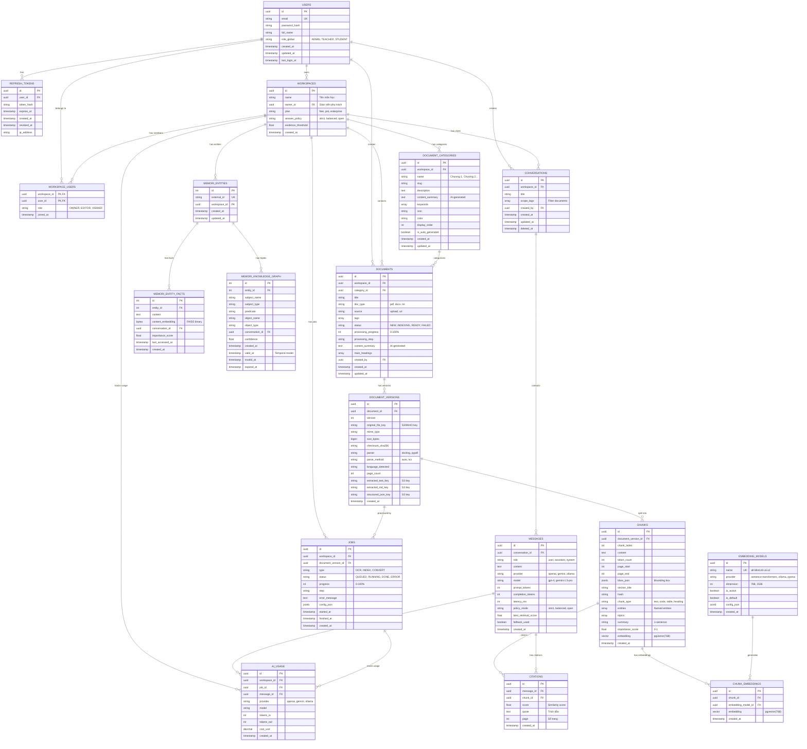

# ERD Diagram - Hệ thống RAG cho Sinh viên

## 📊 Entity Relationship Diagram (Mermaid)



---

## 🔑 Key Relationships

### 1. **User → Workspace (Môn học)**
- **1:N** - Một giáo viên có thể dạy nhiều môn học (owner)
- **M:N** - Một sinh viên có thể học nhiều môn học (workspace_users)

### 2. **Workspace → Document**
- **1:N** - Một môn học có nhiều tài liệu
- **Document → Document_Version** (1:N) - Hỗ trợ versioning

### 3. **Document_Version → Chunk**
- **1:N** - Một tài liệu được chia thành nhiều chunks
- **Chunk → Chunk_Embedding** (1:N) - Hỗ trợ nhiều embedding models

### 4. **Workspace → Conversation**
- **1:N** - Một môn học có nhiều conversations
- **Conversation → Message** (1:N) - Một conversation có nhiều messages

### 5. **Message → Citation**
- **1:N** - Một message có nhiều citations
- **Citation → Chunk** (N:1) - Trỏ đến chunk nguồn

---

## 📐 Cardinality Summary

| Relationship | Type | Description |
|-------------|------|-------------|
| User → Workspace | 1:N | Giáo viên sở hữu môn học |
| User ↔ Workspace | M:N | Sinh viên học môn học |
| Workspace → Document | 1:N | Môn học chứa tài liệu |
| Document → Document_Version | 1:N | Versioning |
| Document_Version → Chunk | 1:N | Chunking |
| Chunk → Chunk_Embedding | 1:N | Multi-model embeddings |
| Workspace → Conversation | 1:N | Chat sessions |
| Conversation → Message | 1:N | Chat history |
| Message → Citation | 1:N | Source citations |
| Citation → Chunk | N:1 | Reference to source |

---

## 🎯 Indexes (Quan trọng cho Performance)

```sql
-- User indexes
CREATE INDEX idx_users_email ON users(email);
CREATE INDEX idx_users_role ON users(role_global);

-- Workspace indexes
CREATE INDEX idx_workspace_users_workspace ON workspace_users(workspace_id);
CREATE INDEX idx_workspace_users_user ON workspace_users(user_id);

-- Document indexes
CREATE INDEX idx_documents_workspace_status ON documents(workspace_id, status);
CREATE INDEX idx_documents_category ON documents(category_id);
CREATE INDEX idx_documents_tags ON documents USING GIN(tags);

-- Chunk indexes
CREATE INDEX idx_chunks_doc_version ON chunks(document_version_id);
CREATE INDEX idx_chunks_embedding ON chunks USING ivfflat(embedding vector_cosine_ops);

-- Conversation indexes
CREATE INDEX idx_conversations_workspace ON conversations(workspace_id);
CREATE INDEX idx_messages_conversation ON messages(conversation_id);
CREATE INDEX idx_citations_message ON citations(message_id);
CREATE INDEX idx_citations_chunk ON citations(chunk_id);

-- Job indexes
CREATE INDEX idx_jobs_workspace_status ON jobs(workspace_id, status);
CREATE INDEX idx_jobs_status ON jobs(status);

-- AI Usage indexes
CREATE INDEX idx_ai_usage_workspace ON ai_usage(workspace_id);
CREATE INDEX idx_ai_usage_created ON ai_usage(created_at);
```

---

## 🔍 Vector Search (pgvector)

```sql
-- Enable pgvector extension
CREATE EXTENSION IF NOT EXISTS vector;

-- Create vector index for fast similarity search
CREATE INDEX idx_chunks_embedding 
ON chunks 
USING ivfflat (embedding vector_cosine_ops)
WITH (lists = 100);

-- Query example: Find similar chunks
SELECT 
    c.id,
    c.content,
    c.page_start,
    dv.document_id,
    d.title,
    1 - (c.embedding <=> '[0.1, 0.2, ...]'::vector) AS similarity
FROM chunks c
JOIN document_versions dv ON c.document_version_id = dv.id
JOIN documents d ON dv.document_id = d.id
WHERE d.workspace_id = 'workspace-uuid'
ORDER BY c.embedding <=> '[0.1, 0.2, ...]'::vector
LIMIT 5;
```

---

## 📊 Database Size Estimation

Giả sử môn học có:
- 10 tài liệu PDF (mỗi file ~5MB, ~100 trang)
- Mỗi trang → 3 chunks
- Mỗi chunk → 768-dim embedding (3KB)

**Ước tính**:
- Documents: 10 rows × 1KB = 10KB
- Document_Versions: 10 rows × 2KB = 20KB
- Chunks: 10 × 100 × 3 = 3,000 rows × 5KB = 15MB
- Chunk_Embeddings: 3,000 rows × 3KB = 9MB
- **Total**: ~25MB/môn học

Với 100 môn học → ~2.5GB

---

## 🚀 Optimization Tips

1. **Partitioning**: Partition `chunks` table by `workspace_id` nếu có nhiều môn học
2. **Archiving**: Archive old conversations sau 1 năm
3. **Caching**: Cache embeddings trong Redis
4. **Connection Pooling**: Sử dụng pgBouncer
5. **Read Replicas**: Tách read/write cho scalability

---

**Lưu ý**: ERD này đã loại bỏ các bảng không liên quan (CloudCode, OCR, Image generation) để tập trung vào core RAG features phù hợp với đề tài sinh viên.
