# Sơ Đồ Kiến Trúc Hệ Thống RAG - Chi Tiết Đầy Đủ

> **Tài liệu này**: Mô tả chi tiết kiến trúc hệ thống AI hỗ trợ sinh viên học tập với RAG
> 
> **Bao gồm**: OCR Flow, Memori Integration, Intent Detection, LLM Fallback, RAG Patterns

---

## 📋 Mục Lục

1. [Tổng Quan Kiến Trúc](#1-tổng-quan-kiến-trúc)
2. [Flow 1: Upload & OCR Processing](#2-flow-1-upload--ocr-processing)
3. [Flow 2: RAG Chat Query với Intent Detection](#3-flow-2-rag-chat-query-với-intent-detection)
4. [Flow 3: Memori Integration (Knowledge Graph)](#4-flow-3-memori-integration-knowledge-graph)
5. [Flow 4: LLM Provider Fallback Chain](#5-flow-4-llm-provider-fallback-chain)
6. [Flow 5: RAG Patterns (Advanced)](#6-flow-5-rag-patterns-advanced)
7. [Công Nghệ & Tối Ưu](#7-công-nghệ--tối-ưu)

---

## 1. Tổng Quan Kiến Trúc

### 1.1 Kiến Trúc Tổng Thể

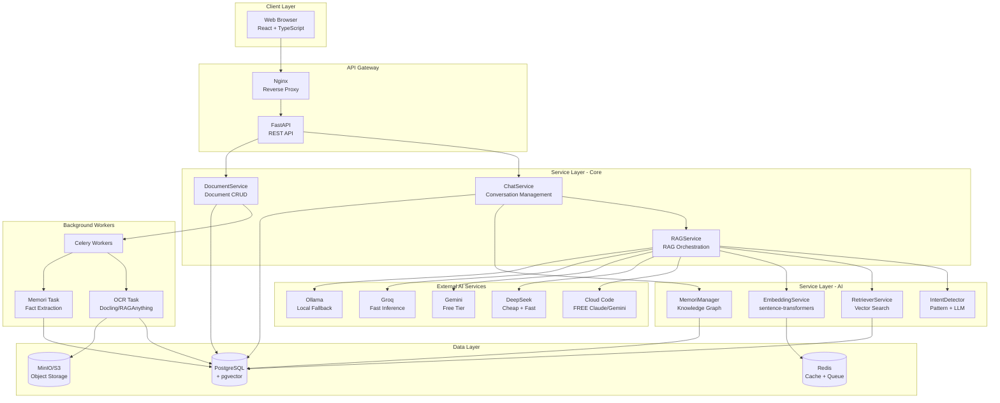

### 1.2 Đặc Điểm Chính

**Kiến Trúc Phân Tầng**:
- **Client**: React SPA với TypeScript
- **API Gateway**: Nginx + FastAPI (async)
- **Service Layer**: Business logic (Chat, Document, RAG, Memori)
- **Data Layer**: PostgreSQL + pgvector + Redis + MinIO
- **Background Jobs**: Celery workers cho xử lý nặng

**Tính Năng Nổi Bật**:
- ✅ **Multi-Provider LLM**: Auto fallback khi hết quota
- ✅ **Intent Detection**: Pattern matching + LLM fallback
- ✅ **Knowledge Graph**: Memori với semantic triples
- ✅ **Advanced RAG**: 7 patterns (Corrective, Self, Adaptive, CORAG, CORAL, REVEAL, Speculative)
- ✅ **Vector Search**: pgvector với HNSW index
- ✅ **Async Processing**: Celery cho OCR và fact extraction

---

## 2. Flow 1: Upload & OCR Processing

### 2.1 Sơ Đồ Chi Tiết

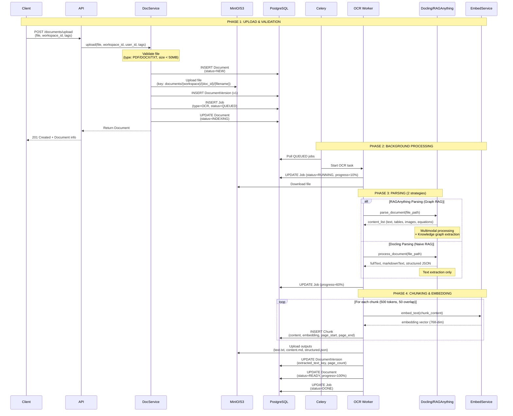

### 2.2 Chi Tiết Các Bước

**Bước 1: Upload & Validation**
- Client upload file qua multipart/form-data
- Validate: type (PDF, DOCX, TXT), size (< 50MB)
- Create Document record với status=NEW
- Upload file lên MinIO/S3 với key: `documents/{workspace_id}/{document_id}/{filename}`
- Calculate SHA256 checksum để detect duplicates

**Bước 2: Queue Background Job**
- Create Job record (type=OCR, status=QUEUED)
- Celery worker poll và pick up job
- Update Document status=INDEXING (frontend shows "Processing...")

**Bước 3: Parsing - 2 Strategies**

**Strategy A: RAGAnything (Graph RAG)**
```python
# Feature flag: ENABLE_RAGANYTHING_PARSING=True
from app.services.rag_service import RAGService

content_list, doc_id = await rag_service.parse_document(
    file_path=tmp_path,
    workspace_id=workspace_id,
    parse_method="auto",  # auto/fast/hi_res
)

# Output: List of content blocks
# - Text blocks with page numbers
# - Tables (structured data)
# - Images (base64 encoded)
# - Equations (LaTeX)
# - Knowledge graph triples
```

**Strategy B: Docling (Naive RAG)**
```python
# Fallback when RAGAnything not available
from app.core.engines.ocr import DocumentEngine

result = await engine.process_document(
    job_id=job_id,
    file_path=tmp_path,
    settings_dict={
        "parser": "docling",
        "parse_method": "auto",
        "language": "auto",
    }
)

# Output: Simple text extraction
# - fullText: Plain text
# - markdownText: Markdown formatted
# - structured: JSON metadata
```

**Bước 4: Chunking**
- Split content thành chunks ~500 tokens
- Overlap 50 tokens giữa các chunks (preserve context)
- Preserve metadata: page_start, page_end, section_title

**Bước 5: Embedding**
- Model: `sentence-transformers/paraphrase-multilingual-MiniLM-L12-v2`
- Dimension: 768
- Cache embeddings trong Redis (key: MD5(text))

**Bước 6: Indexing**
- Insert chunks vào PostgreSQL với pgvector
- Create HNSW index cho fast similarity search
- Update Document status=READY

---

## 3. Flow 2: RAG Chat Query với Intent Detection

### 3.1 Sơ Đồ Chi Tiết

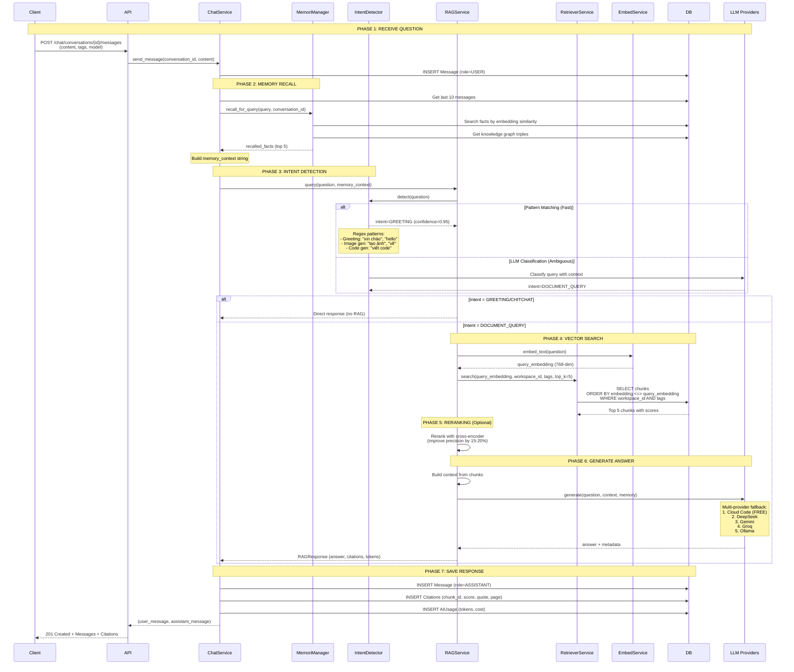

### 3.2 Chi Tiết Intent Detection

**Pattern Matching (Fast, Deterministic)**:
```python
# Greeting patterns
GREETING_PATTERNS = [
    r"^(hi|hello|hey|xin\s*chào|chào)[\s!.,?]*$",
    r"^good\s*(morning|afternoon|evening)[\s!.,?]*$",
]

# Image generation patterns
IMAGE_GENERATION_PATTERNS = [
    r"(tạo|vẽ|sinh|generate)\s*(một\s*)?(ảnh|hình|tranh)",
    r"(generate|create|make|draw)\s*(an?\s*)?(image|picture)",
]

# Code generation patterns
CODE_GENERATION_PATTERNS = [
    r"(viết|tạo|code)\s*(code|hàm|function|class)",
    r"(write|create|implement)\s*(a\s*)?(function|class|script)",
]
```

**LLM Classification (Ambiguous Cases)**:
```python
# Prompt template
INTENT_CLASSIFICATION_PROMPT = """Classify the query into ONE category:

- `greeting`: Greetings (hi, hello, xin chào)
- `chitchat`: General chat NOT about documents
- `document`: Questions about topics in document categories
- `image_generation`: Create/draw images
- `code_generation`: Write code

Document Categories: {document_context}

Output JSON only: {{"intent": "<type>", "response": "<if greeting/chitchat else null>"}}

Query: "{query}"
"""

# Multi-provider fallback
# 1. Cloud Code (FREE Claude/Gemini) - Best quality
# 2. DeepSeek - Strong, fast, cheap
# 3. Gemini - Good quality, free tier
# 4. Groq - Fast, free tier
# 5. Ollama - Local fallback
```

### 3.3 Chi Tiết Vector Search

**Query với pgvector**:
```sql
SELECT 
    c.id as chunk_id,
    d.id as document_id,
    d.title as document_title,
    c.content,
    c.page_start,
    c.page_end,
    c.section_title,
    1 - (c.embedding <=> :query_embedding) as score
FROM chunks c
JOIN document_versions dv ON c.document_version_id = dv.id
JOIN documents d ON dv.document_id = d.id
WHERE d.workspace_id = :workspace_id
  AND d.status = 'READY'
  AND c.embedding IS NOT NULL
  AND d.tags && ARRAY[:tags]::varchar[]  -- Tag filtering
  AND 1 - (c.embedding <=> :query_embedding) >= :min_score
ORDER BY c.embedding <=> :query_embedding
LIMIT :top_k
```

**Indexes**:
```sql
-- HNSW index for fast vector search
CREATE INDEX idx_chunks_embedding ON chunks 
USING hnsw (embedding vector_cosine_ops);

-- GIN index for tag filtering
CREATE INDEX idx_documents_tags ON documents USING GIN (tags);
```

---

## 4. Flow 3: Memori Integration (Knowledge Graph)

### 4.1 Sơ Đồ Chi Tiết

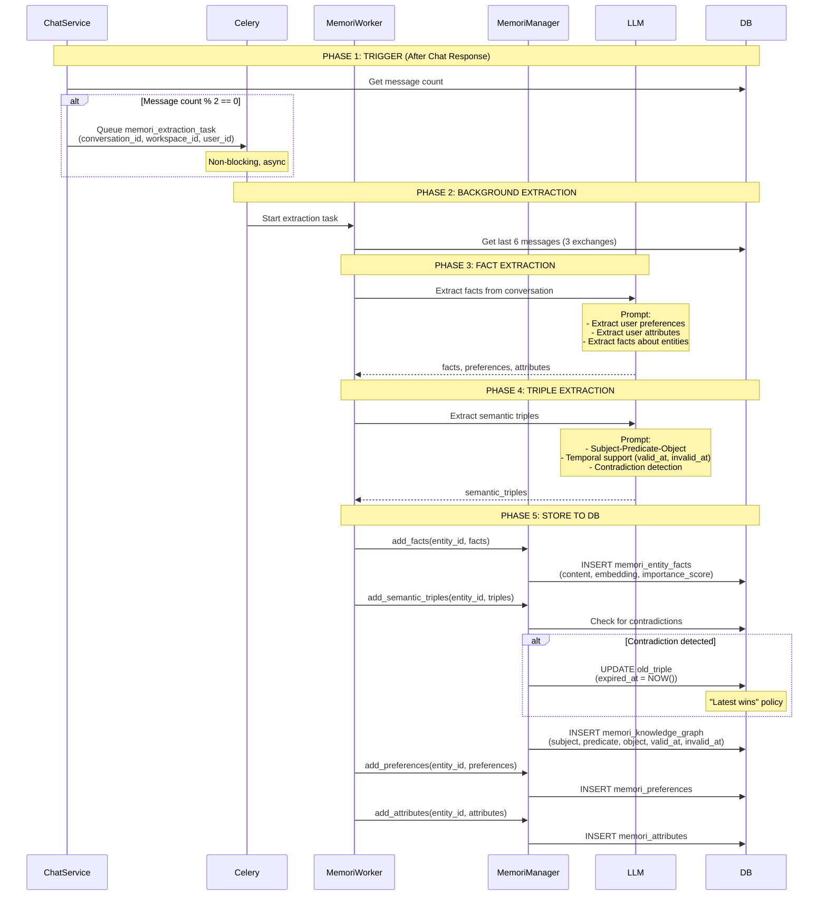

### 4.2 Chi Tiết Fact Extraction

**Extraction Prompt**:
```python
FACT_EXTRACTION_PROMPT = """Analyze this conversation and extract important facts.

CONVERSATION:
USER: Tôi đang học Python và muốn làm AI engineer
ASSISTANT: Tuyệt vời! Python là ngôn ngữ tốt cho AI...
USER: Tôi sống ở Hà Nội và đang học năm 3

Extract:
1. Facts about the user (preferences, background, interests)
2. Key decisions or statements made
3. Important context for future conversations

Return as JSON:
{
    "facts": [
        "User is learning Python",
        "User wants to become an AI engineer",
        "User lives in Hanoi",
        "User is in year 3 of university"
    ],
    "preferences": {
        "programming_language": "Python",
        "career_goal": "AI engineer"
    },
    "attributes": {
        "location": "Hanoi",
        "education_level": "Year 3 university"
    }
}
"""
```

**Triple Extraction with Temporal Support**:
```python
TRIPLE_EXTRACTION_PROMPT = """Extract semantic triples with temporal awareness.

FACTS:
- User is learning Python
- User lives in Hanoi
- User used to live in Ho Chi Minh City

INSTRUCTIONS:
1. PRONOUN RESOLUTION: Replace "tôi", "mình", "I" → "user"
2. TEMPORAL EXTRACTION:
   - "trước đây", "used to" → set invalid_at to "now"
   - "từ [date]", "since" → set valid_at to that date
3. NEGATION: "không ... nữa" → mark with invalid_at

Return JSON array:
[
    {"s":"user","st":"person","p":"is_learning","o":"Python","ot":"programming_language","valid_at":null,"invalid_at":null,"confidence":0.9},
    {"s":"user","st":"person","p":"lives_in","o":"Hanoi","ot":"location","valid_at":"now","invalid_at":null,"confidence":0.9},
    {"s":"user","st":"person","p":"lives_in","o":"Ho Chi Minh City","ot":"location","valid_at":null,"invalid_at":"now","confidence":0.8}
]
"""
```

### 4.3 Contradiction Detection

**Graphiti-Inspired Bi-Temporal Model**:
```python
# Check for contradictions
contradicted = await get_edge_contradictions(
    rag_service, new_triple, existing_triples
)

if contradicted:
    # "Latest wins" policy
    await invalidate_contradicted_edges(
        session, contradicted, datetime.utcnow()
    )
    # Old triple: expired_at = NOW()
    # New triple: valid_at = NOW(), expired_at = NULL
```

**Example**:
```
Old triple: (user, lives_in, Hanoi, valid_at=2023-01-01, expired_at=NULL)
New triple: (user, lives_in, Ho Chi Minh City, valid_at=2024-01-01, expired_at=NULL)

After contradiction detection:
Old triple: (user, lives_in, Hanoi, valid_at=2023-01-01, expired_at=2024-01-01)
New triple: (user, lives_in, Ho Chi Minh City, valid_at=2024-01-01, expired_at=NULL)
```

---

## 5. Flow 4: LLM Provider Fallback Chain

### 5.1 Sơ Đồ Chi Tiết

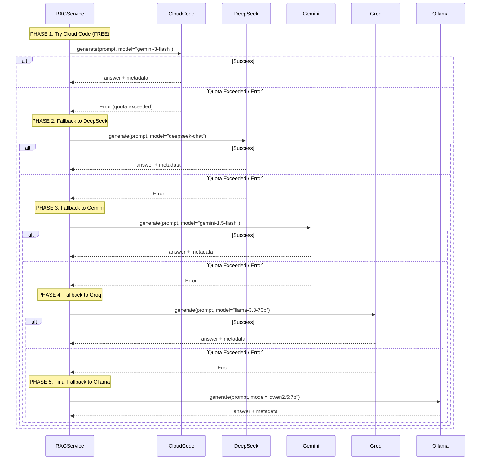

### 5.2 Chi Tiết Implementation

**Priority Order (Strongest → Weakest)**:
```python
async def _generate_answer_with_fallback(
    self, question: str, context: str, model: Optional[str] = None
) -> tuple:
    """
    Generate answer with multi-provider fallback chain.
    
    Priority:
    1. Cloud Code (FREE Claude/Gemini) - Best quality, no cost
    2. DeepSeek - Strong, fast, cheap ($0.14/1M tokens)
    3. Gemini - Good quality, free tier (15 RPM)
    4. Groq - Fast inference, free tier (30 RPM)
    5. Ollama - Local fallback, always available
    """
    
    # Priority 1: Cloud Code
    try:
        result = await self._call_cloudcode(question, context, model)
        if result:
            return result
    except QuotaExceededError:
        logger.warning("Cloud Code quota exceeded, trying DeepSeek")
    except Exception as e:
        logger.warning(f"Cloud Code error: {e}")
    
    # Priority 2: DeepSeek
    try:
        result = await self._call_deepseek(question, context, model)
        if result:
            return result
    except QuotaExceededError:
        logger.warning("DeepSeek quota exceeded, trying Gemini")
    except Exception as e:
        logger.warning(f"DeepSeek error: {e}")
    
    # Priority 3: Gemini
    try:
        result = await self._call_gemini(question, context, model)
        if result:
            return result
    except QuotaExceededError:
        logger.warning("Gemini quota exceeded, trying Groq")
    except Exception as e:
        logger.warning(f"Gemini error: {e}")
    
    # Priority 4: Groq
    try:
        result = await self._call_groq(question, context, model)
        if result:
            return result
    except QuotaExceededError:
        logger.warning("Groq quota exceeded, trying Ollama")
    except Exception as e:
        logger.warning(f"Groq error: {e}")
    
    # Priority 5: Ollama (always available)
    return await self._call_ollama(question, context, model)
```

**API Key Management**:
```python
class APIKeyManager:
    """
    Manages API keys with rotation and quota tracking.
    
    Features:
    - Multiple keys per provider
    - Automatic rotation on quota exceeded
    - Success/failure tracking
    - Cooldown period for failed keys
    """
    
    def get_key(self, provider: str) -> Optional[str]:
        """Get next available key for provider."""
        keys = self._keys.get(provider, [])
        for key in keys:
            if not self._is_on_cooldown(key):
                return key
        return None
    
    def mark_quota_exceeded(self, provider: str, key: str):
        """Mark key as quota exceeded (cooldown 1 hour)."""
        self._cooldowns[key] = datetime.utcnow() + timedelta(hours=1)
    
    def mark_success(self, provider: str, key: str):
        """Mark key as successful (remove from cooldown)."""
        if key in self._cooldowns:
            del self._cooldowns[key]
```

---

## 6. Flow 5: RAG Patterns (Advanced)

### 6.1 Tổng Quan 7 Patterns

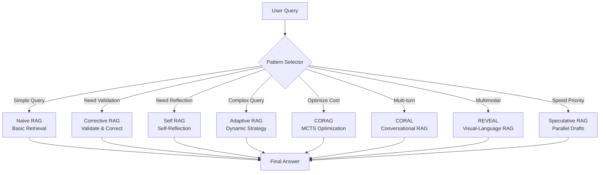

### 6.2 Pattern 1: Corrective RAG

**Mục đích**: Validate retrieved documents và correct nếu không relevant

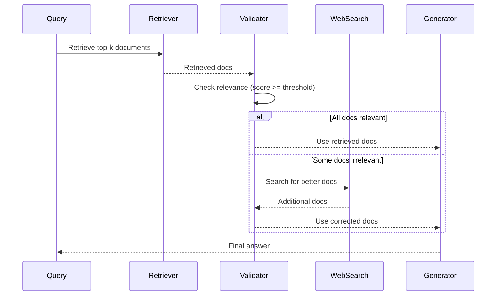

**Code**:
```python
result = await rag_service.query_with_corrective_rag(
    question=question,
    documents=retrieved_docs,
    relevance_threshold=0.6,
    max_correction_attempts=2,
)
```

### 6.3 Pattern 2: Self RAG

**Mục đích**: Self-reflection để check hallucinations

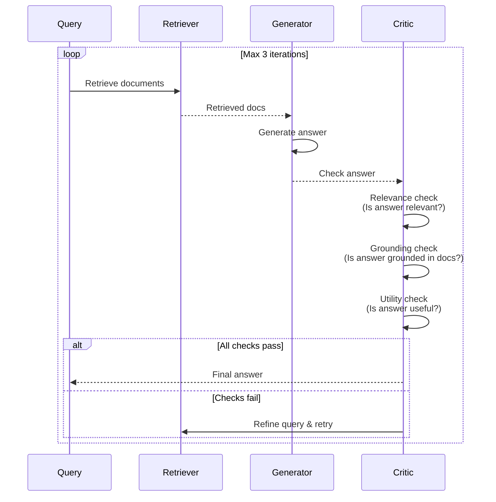

**Code**:
```python
result = await rag_service.query_with_self_rag(
    question=question,
    documents=retrieved_docs,
    max_iterations=3,
    min_relevance_score=0.6,
    min_grounding_score=0.5,
)
```

### 6.4 Pattern 3: Adaptive RAG

**Mục đích**: Dynamic strategy selection based on query complexity

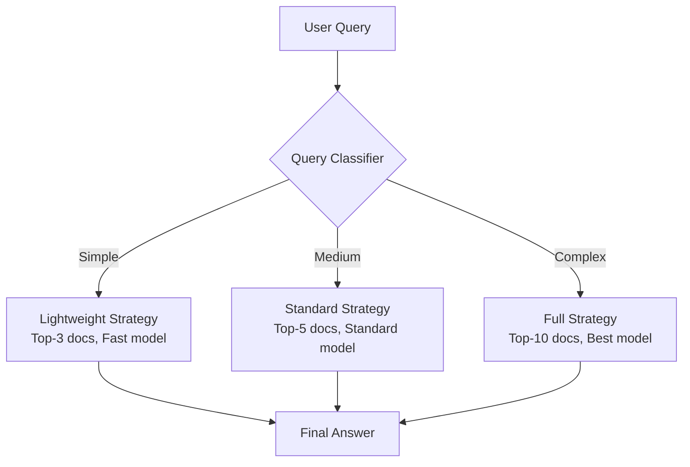

**Code**:
```python
result = await rag_service.query_with_adaptive_rag(
    question=question,
    documents=retrieved_docs,
    high_confidence_threshold=0.8,
    low_confidence_threshold=0.6,
    lightweight_top_k=3,
    full_top_k=10,
)
```

### 6.5 Pattern 4: CORAG (Chain-of-Retrieval)

**Mục đích**: Optimize chunk selection với Monte Carlo Tree Search

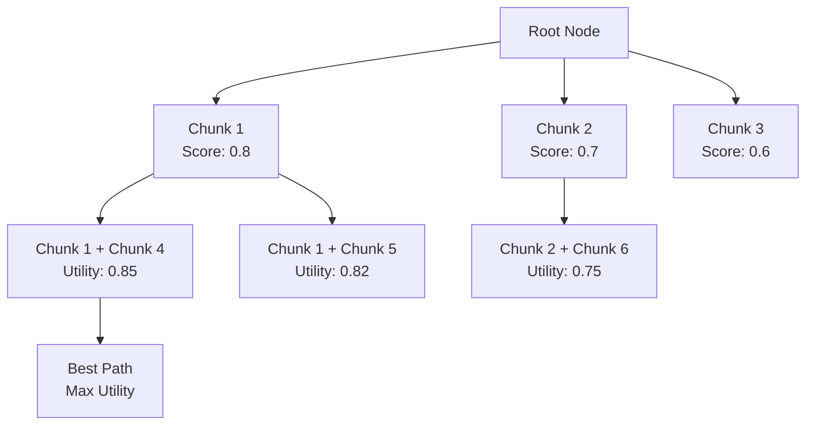

**Code**:
```python
result = await rag_service.query_with_corag(
    question=question,
    documents=retrieved_docs,
    cost_weight=0.3,
    mcts_iterations=100,
)
```

### 6.6 Pattern 5: CORAL (Conversational RAG)

**Mục đích**: Multi-turn conversation với context tracking

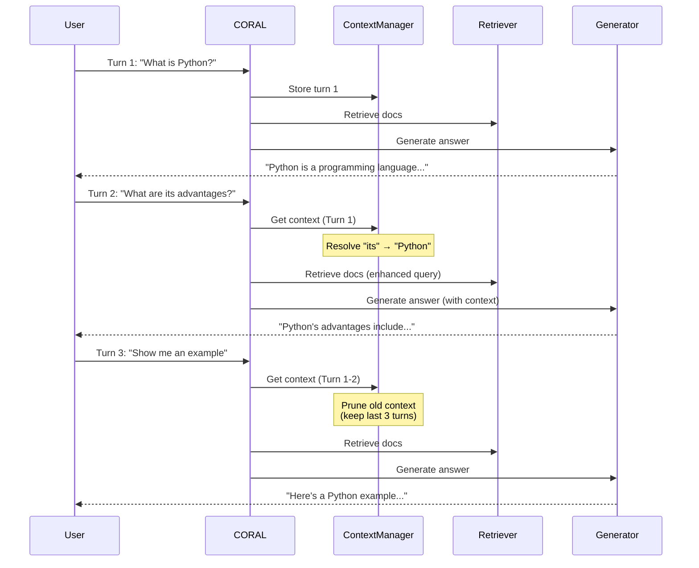

**Code**:
```python
result = await rag_service.query_with_coral(
    user_message=message,
    conversation_id=conversation_id,
    max_history_turns=10,
    context_window_size=4096,
    use_context_enhancement=True,
)
```

### 6.7 Pattern 6: REVEAL (Visual-Language RAG)

**Mục đích**: Multimodal RAG với text + images

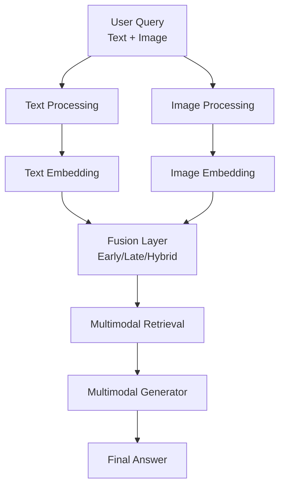

**Code**:
```python
result = await rag_service.query_multimodal_reveal(
    text_query=text_query,
    visual_query=image_data,
    top_k=5,
    fusion_strategy="hybrid",
    visual_weight=0.4,
    text_weight=0.6,
)
```

### 6.8 Pattern 7: Speculative RAG

**Mục đích**: Parallel draft generation cho speed

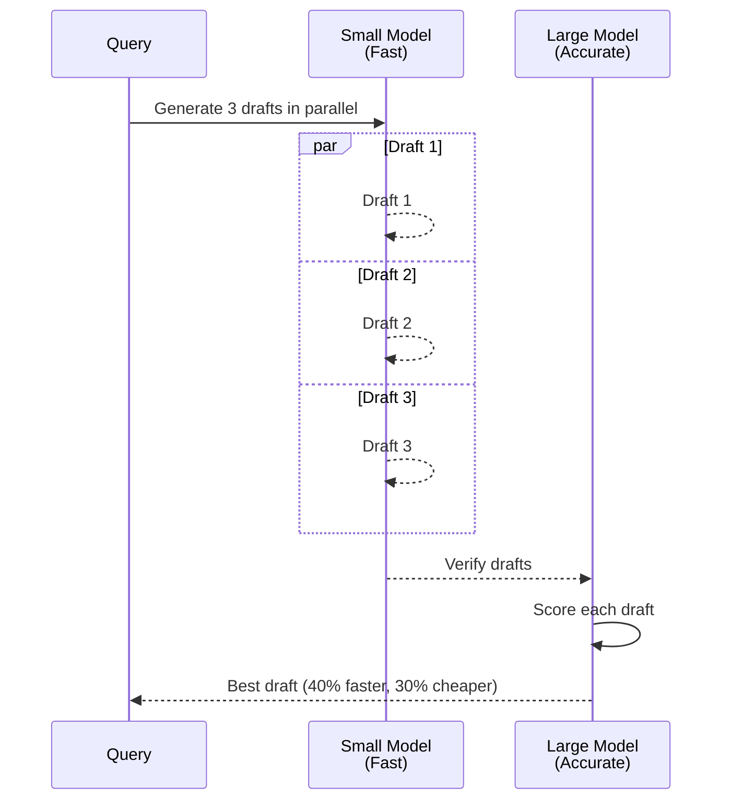

**Code**:
```python
result = await rag_service.query_with_speculative_rag(
    question=question,
    documents=retrieved_docs,
    num_drafts=3,
    small_model="gpt-3.5-turbo",
    large_model="gpt-4",
    enable_merging=False,
)
```

---

## 7. Công Nghệ & Tối Ưu

### 7.1 Technology Stack

| Layer | Technology | Purpose |
|-------|-----------|---------|
| **Frontend** | React 18 + TypeScript | UI framework |
| **API** | FastAPI + Uvicorn | Async REST API |
| **Database** | PostgreSQL 15 + pgvector | Relational + Vector DB |
| **Cache** | Redis 7 | Embedding cache, queue |
| **Storage** | MinIO/S3 | Object storage |
| **Queue** | Celery + Redis | Background jobs |
| **Embeddings** | sentence-transformers | Text → Vector (768-dim) |
| **LLM** | Multi-provider | Cloud Code, DeepSeek, Gemini, Groq, Ollama |
| **OCR** | Docling/RAGAnything | Document parsing |
| **Knowledge Graph** | Memori | Entity facts + triples |

### 7.2 Performance Optimizations

**Database**:
```sql
-- HNSW index for vector search (10x faster)
CREATE INDEX idx_chunks_embedding ON chunks 
USING hnsw (embedding vector_cosine_ops)
WITH (m = 16, ef_construction = 64);

-- GIN index for tag filtering
CREATE INDEX idx_documents_tags ON documents USING GIN (tags);

-- B-tree indexes for common queries
CREATE INDEX idx_messages_conversation ON messages (conversation_id, created_at DESC);
CREATE INDEX idx_documents_workspace ON documents (workspace_id, status);
```

**Caching Strategy**:
```python
# Redis cache layers
CACHE_LAYERS = {
    "embeddings": {
        "key": "emb:{model_id}:{md5(text)}",
        "ttl": None,  # Unlimited (embeddings don't change)
    },
    "intent": {
        "key": "intent:{md5(query)}",
        "ttl": 3600,  # 1 hour
    },
    "search_results": {
        "key": "search:{md5(query+filters)}",
        "ttl": 1800,  # 30 minutes
    },
}
```

**Async Processing**:
```python
# Concurrent LLM calls
results = await asyncio.gather(
    llm_call_1(),
    llm_call_2(),
    llm_call_3(),
    return_exceptions=True,
)

# Batch embedding generation
embeddings = embedding_service.embed_batch(texts, batch_size=32)

# Parallel fact extraction
tasks = [extract_facts(batch) for batch in batches]
results = await asyncio.gather(*tasks)
```

### 7.3 Monitoring & Metrics

**Performance Metrics**:
- API response time (p50, p95, p99)
- RAG pipeline latency breakdown
- Vector search performance
- LLM call latency per provider
- Cache hit rate

**Business Metrics**:
- Documents uploaded
- Conversations created
- Messages sent
- Token usage & cost per provider
- Intent detection accuracy

**Logging**:
```python
logger.info(f"⏱️  RAG query: {latency_ms}ms")
logger.info(f"📊 Retrieved {len(chunks)} chunks, best_score={best_score}")
logger.info(f"🤖 LLM: {provider} ({model}), tokens={prompt_tokens}+{completion_tokens}")
logger.info(f"💾 Cache hit rate: {cache_hit_rate:.1%}")
```

---

**Tác giả**: AI Engineering Team  
**Ngày cập nhật**: January 26, 2026  
**Phiên bản**: 2.0 (Chi tiết đầy đủ)
