# Upload Pipeline v3.2 — Architecture

> **Cập nhật**: v3.2 (2026-05-16) — XLSX Docling input is enabled in `DocumentEngine.allowed_formats`; LightRAG `parser=auto` recursion is fixed; PaddleOCR is the only active OCR/sub-OCR path; Surya is legacy-only.  
> **Về v2.0 cũ**: Xem lịch sử git cho bản Surya-based trước đó.

---

## 1. Flow Tổng Quan (Architecture Diagram)

```mermaid
graph TD
    %% Tầng API & Storage
    User([Người dùng]) -->|1. Upload File| API(Documents API)
    API -->|2. Validate Type/Size/Checksum| Validator{Hợp lệ?}
    Validator -->|Không| Reject[Báo lỗi 400]
    Validator -->|Có| MinIO[(MinIO Storage)]
    
    %% Tầng Database
    MinIO -->|3. Lưu bản gốc| DB[(PostgreSQL)]
    DB -->|4. Tạo Document NEW + Version + Dedup| DocV[Tạo DocumentVersion v1]
    DocV -->|5. Status → INDEXING| JobQ[Tạo Job OCR QUEUED]
    
    %% Celery OCR Worker
    JobQ -->|6. commit → enqueue| CeleryOCR((Celery OCR Worker))
    CeleryOCR -->|7. Detect file type| Router{Parser Router}
    
    Router -->|Route 0: .txt .md .csv .html| ParserDirect[Direct Text Parser]
    Router -->|Route 1: Image / Forced| ParserPaddle[PaddleOCR Engine<br>PPStructureV3 → Markdown]
    Router -->|Route 2: Default| ParserDocling[Docling Engine<br>Structural Extraction]
    
    ParserDocling -->|Sub-OCR embedded images| SubOCR{PaddleOCR Sub-OCR}
    SubOCR -.->|Nếu PaddleOCR unavailable| SubSkip[Skip sub-OCR<br>log warning]
    
    ParserDirect --> Normalize[Bước 8: Normalize Module<br>Canonical content_list]
    ParserPaddle --> Normalize
    ParserDocling --> Normalize
    
    Normalize -->|9. Quality Gate min_chars=50| QGate{Quality Gate}
    QGate -->|Rỗng / Dưới Threshold| Fail[Document FAILED]
    QGate -->|Pass| Split[Bước 10: Fork luồng]
    
    %% Async Workers song song
    Split -->|content.md| CeleryIndex((INDEX Worker))
    Split -->|structured.json + content_list| CeleryEnrich((ENRICHMENT Worker))
    
    %% Nhánh 1: Indexing
    subgraph Vector RAG
        CeleryIndex -->|chunk_by_sentences| Chunk[LlamaIndex SentenceSplitter<br>chunk_size=512 overlap=50]
        Chunk -->|embed_batch| Embed[SentenceTransformer<br>mpnet-base-v2 dim=768]
        Embed -->|pgvector INSERT| PGVector[(pgvector Vector 768)]
        PGVector -->|Status Update| ReadyBasic[READY_BASIC<br>or INDEXING 95 if STRICT_NEO4J]
    end
    
    %% Nhánh 2: Enrichment
    subgraph Graph RAG
        CeleryEnrich -->|insert_content_list| RAGA[RAGAnything Pipeline]
        RAGA -->|Entity + Relation| LLM[LLM Processing]
        LLM -->|Neo4j/LightRAG| GraphDB[(Knowledge Graph)]
        GraphDB -->|Status Update| ReadyEnriched[READY_ENRICHED<br>Full Graph!]
    end

    %% Search
    ReadyBasic -.-> Hybrid[Hybrid Retriever]
    ReadyEnriched -.-> Hybrid
    User -->|Chat/Search| Hybrid

    classDef worker fill:#f9f,stroke:#333,stroke-width:2px;
    classDef db fill:#bbf,stroke:#333,stroke-width:2px;
    classDef status fill:#cfc,stroke:#333,stroke-width:2px;
    classDef engine fill:#ffd,stroke:#666,stroke-width:1px;
    classDef legacy fill:#eee,stroke:#999,stroke-width:1px,stroke-dasharray: 5 5;
    
    class CeleryOCR,CeleryIndex,CeleryEnrich worker;
    class DB,MinIO,PGVector,GraphDB db;
    class ReadyBasic,ReadyEnriched,Fail status;
    class ParserPaddle,ParserDocling,ParserDirect engine;
    class SubSkip legacy;
```

---

## 2. Giải thích chi tiết các bước

### Bước 1-5: Tiếp nhận (Ingestion)

1. **API Upload**: `app/api/v1/documents.py` nhận file qua multipart/form-data hoặc presigned URL.
2. **Validate**: Kiểm tra tên file (whitelist extensions), kích thước (limit), MIME type.
3. **MinIO Storage**: File gốc được upload lên MinIO/S3 object storage qua `ObjectStore`.
4. **Database Records**: PostgreSQL:
   - Tạo `Document` (status=`NEW`)
   - Tạo `DocumentVersion` (v=1, checksum_sha256)
   - **Dedup check**: So sánh SHA-256 với tất cả version trong workspace → reject nếu trùng
   - Tạo `Job` (type=`OCR`, status=`QUEUED`)
5. **Trạng thái**: Document → `INDEXING`. **Commit DB trước, enqueue Celery sau** (đảm bảo worker đọc được data).

### Bước 6-8: Parsing & Extraction (Stage 1)

OCR Worker (`celery-worker-ocr`) nhận job:

1. Download file từ MinIO vào temp. Hỗ trợ cả HTTP URL.
2. **Parser Router** quyết định engine:

| Route | Điều kiện | Engine | Output |
|-------|-----------|--------|--------|
| **Route 0** | `.txt`, `.md`, `.csv`, `.json`, `.rtf`, `.odt`, `.html`, `.xhtml` | Direct text read | UTF-8/RTF/ODT extraction |
| **Route 1** | `.jpg`, `.png`, `.webp`, `.tiff`, `.bmp` hoặc `config.parser=paddleocr` hoặc `USE_PADDLEOCR_FOR_PDF=true` | **PaddleOCREngine** (PPStructureV3) | Markdown + structured layout |
| **Route 2** | Mặc định (`.pdf`, `.docx`, `.xlsx`, `.pptx`) | **DocumentEngine** (Docling) | Markdown + DoclingDocument JSON |

Frontend preview note: `DocumentViewer` renders PDF/image/DOCX with native viewers. `PPTX` and `XLSX` do not use a binary Office renderer; the Original tab displays extracted markdown from backend content, and `XLSX` markdown tables are rendered as HTML tables.

3. **Sub-OCR** cho embedded images (chỉ trong Route 2):
   - **PDF**: Phát hiện vùng `type=image` → crop → PaddleOCR `process_crops()` → append text
   - **DOCX**: Parse XML structure → extract media → PaddleOCR `ocr_image()` → insert `[Image Text: ...]` tại đúng vị trí paragraph
   - Priority: PaddleOCR → Skip with warning (Surya is not active)

4. **Normalize Module** (`normalize.py`): Ép tất cả output về canonical format `content_list` (text / image / table / equation) — tương thích RAG-Anything API.

### Bước 9: Quality Gate (Stage 1.5)

- `quality_check(min_chars=50)`: Kiểm tra text length
- Bypass nếu có image/table/equation (multimodal docs)
- Fail → Document `FAILED`, dừng pipeline

### Bước 10-11: Fork (Stage 3)

Thay vì OCR worker tự làm tiếp (gây nghẽn), ta fork:

1. **INDEX Worker** (nhanh, bắt buộc):
   - Load `content.md` từ MinIO
   - **`ChunkingService.chunk_by_sentences()`**: LlamaIndex `SentenceSplitter` với:
     - `chunk_size=512`, `chunk_overlap=50`
     - `paragraph_separator="\n\n"`
     - `secondary_chunking_regex="[.!?]\\s+"`
   - **`EmbeddingService.embed_batch()`**: `paraphrase-multilingual-mpnet-base-v2` → dim=768 native (không pad zero)
   - INSERT chunks + vectors → pgvector
   - Document → `READY_BASIC` *(searchable ngay)* nếu `STRICT_NEO4J=false`
   - Nếu `STRICT_NEO4J=true` (default hiện tại): Document giữ `INDEXING` progress 95 và chờ enrichment Neo4j hoàn tất

2. **ENRICHMENT Worker** (chậm, optional):
   - Load `structured.json` → reuse canonical `content_list`
   - `RAGAnything.insert_content_list()` → Entity/Relation extraction → Knowledge Graph
   - Document → `READY_ENRICHED` *(nếu thành công)*
   - Nếu `STRICT_NEO4J=false`: Fail → document giữ `READY_BASIC`, vẫn searchable
   - Nếu `STRICT_NEO4J=true`: Fail sau retry → document `FAILED` để báo rõ graph backend không đạt yêu cầu

---

## 3. Hệ Sinh Thái Trạng Thái

| Trạng thái | Diễn giải | Search |
|------------|-----------|--------|
| `NEW` | Mới tạo, chưa xử lý | ❌ |
| `UPLOADING` | Đang presigned upload | ❌ |
| `INDEXING` | Đang trong pipeline OCR/Index | ❌ |
| `FAILED` | Lỗi parser, quality gate, hoặc crash | ❌ |
| **`READY_BASIC`** | Vector index xong, chờ enrichment | ✅ Vector + BM25 |
| **`READY_ENRICHED`** | Tất cả pipeline hoàn tất | ✅ Vector + BM25 + Graph |
| `READY` | Legacy status (data cũ) | ✅ = READY_BASIC |
| `ARCHIVED` | Ẩn, không xóa | ❌ |
| `DELETED` | Xóa mềm | ❌ |

---

## 4. Technology Stack (v3.2)

| Component | Technology | Ghi chú |
|-----------|-----------|---------|
| **OCR (ảnh/scan)** | PaddleOCR PP-OCRv5 + PPStructureV3 | CPU-optimized, ~5-10s/page |
| **Parser (digital)** | Docling | PDF/DOCX/XLSX structural extraction |
| **Sub-OCR fallback** | None in active path | PaddleOCR unavailable means skip + warning; Surya is legacy-only |
| **Chunking** | LlamaIndex SentenceSplitter | Sentence-aware, context-preserving |
| **Embedding** | SentenceTransformer `mpnet-base-v2` | dim=768 native, local, zero-cost |
| **Vector DB** | pgvector (Vector 768) | PostgreSQL extension |
| **Graph RAG** | RAGAnything + Neo4j/LightRAG | Optional enrichment layer |

---

## 5. Docker Workers

| Worker | Queue | Concurrency | Vai trò |
|--------|-------|-------------|---------|
| `celery-worker-ocr` | `ocr,convert` | 2 | Parser/OCR (PaddleOCR, Docling) |
| `celery-worker-index` | `index,default` | 2 | Chunking + Embedding (nhẹ, nhanh) |
| `celery-worker-enrichment` | `enrichment` | 1 | RAGAnything Graph (chặn LLM rate limit) |

---

## 6. Tham khảo chi tiết

- **UML Diagram**: [`docs/uml/upload_workflow_new.puml`](../uml/upload_workflow_new.puml)
- **Deep Code Audit**: [`docs/explain/upload_pipeline_audit.md`](../explain/upload_pipeline_audit.md) — code-reality map
- **Legacy UML**: [`docs/uml/upload_workflow_old.puml`](../uml/upload_workflow_old.puml) — Surya-based v2.0
